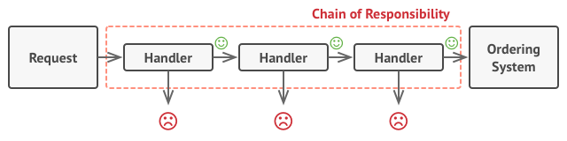

# Overarching Design

The point of the design is to have an extensible class that dynamically changes behavior. To allow for dynamic behavior generation we're starting with the `Strategy` pattern from object oriented design. This is simply to declare a set of conditions to walk through. The second OOP design we're taking is the `Chain-Of-Command` design practice.




```py
from collections import deque
import copy

class ConditionalLock(object):
    def __init__(self):
        self._conditions = deque()
    

    def add(self, condtional: ConditionInstance):
        """ Here we add conditions related to the keys we want to watch"""
        self._conditions.append(conditional)
    

    def process(self, key):
        if (self._conditions) == 0:
            return False

        previous_result = None
        current_conditions = copy.copy(self.conditions)
        while len(current_conditions) != 0:
            item = current_conditions.pop_left()
            previous_result = item.process(previous_result)
            # Checking if we should quit here
            if previous is not None:
                if previous.is_stop == True:
                    return False # IDK, I should have something here
```